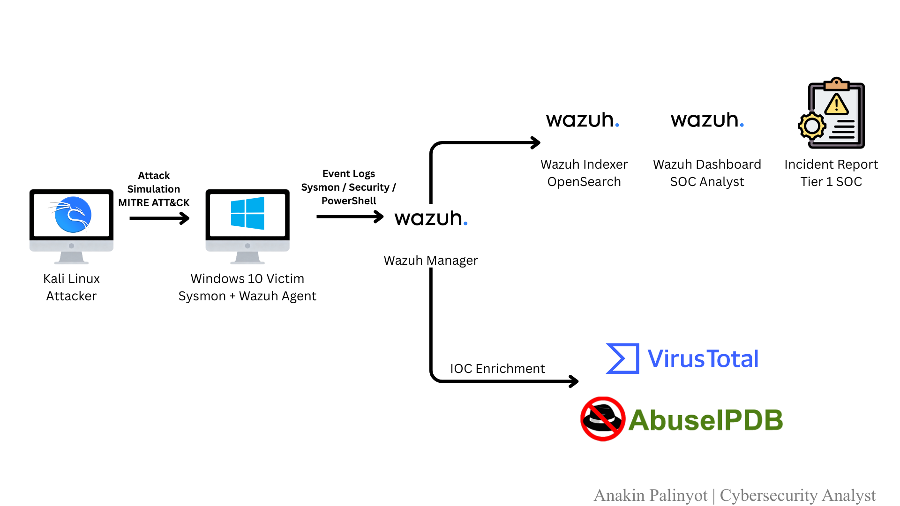
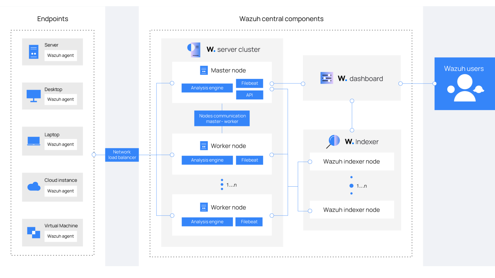
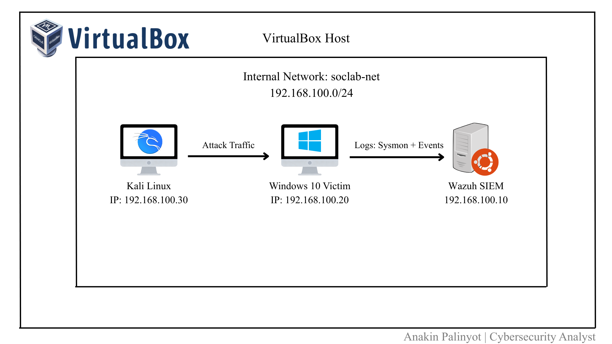

# 🏗️ System Architecture

This document describes the overall system architecture and operational flow of the Home SOC Lab environment.

เอกสารฉบับนี้อธิบายโครงสร้างระบบและลำดับการทำงานของ Home SOC Lab โดยมุ่งเน้นการจำลองการทำงานของ SOC ในสภาพแวดล้อมจริง

---

## 🖥️ Environment Overview

- **Host OS:** ______________________  
- **Virtualization Platform:** ______________________  
- **Network Mode:** ______________________  

---

## 🧩 System Components

| Component | Operating System | Role |
|---------|------------------|------|
| SIEM Server | __________________ | Log collection, correlation, and alerting |
| Endpoint Agent (EDR) | __________________ | Endpoint monitoring & telemetry collection |
| Attack VM | __________________ | Adversary simulation and attack execution |
| Victim VM | __________________ | Target system for attack scenarios |

---

## 🌐 Architecture Diagrams

### 1️⃣ Home SOC Lab – Overall Flow

**Description (EN):**  
This diagram illustrates the end-to-end operational flow of the Home SOC Lab,  
from log generation on endpoints to detection, alerting, and analyst investigation.

**คำอธิบาย (TH):**  
แผนภาพนี้แสดงภาพรวมการทำงานทั้งหมดของ Home SOC Lab  
ตั้งแต่การสร้าง Log บนเครื่องปลายทาง การส่งข้อมูลไปยัง SIEM  
ไปจนถึงการตรวจจับและการวิเคราะห์เหตุการณ์โดย SOC Analyst



---

### 2️⃣ Wazuh Flow – Detailed SIEM & EDR Flow

**Description (EN):**  
This diagram provides a detailed view of the Wazuh data flow, including  
log collection, decoding, rule matching, MITRE ATT&CK mapping, and alert generation.

**คำอธิบาย (TH):**  
แผนภาพนี้แสดงลำดับการทำงานเชิงลึกของ Wazuh  
ตั้งแต่การรับ Log จาก Agent การ Decode ข้อมูล  
การประมวลผล Rule การ Mapping กับ MITRE ATT&CK  
และการสร้าง Alert เพื่อให้ SOC ทำการตรวจสอบ



---

### 3️⃣ Virtual Machine Flow – Network & IP Layout

**Description (EN):**  
This diagram shows the virtual machine layout, network segmentation,  
and IP addressing used within the Home SOC Lab environment.

**คำอธิบาย (TH):**  
แผนภาพนี้แสดงโครงสร้าง Virtual Machine ภายใน Lab  
รวมถึงการแบ่ง Network, IP Address และความสัมพันธ์ระหว่างเครื่องต่าง ๆ  
เพื่อรองรับการจำลองสถานการณ์โจมตีและการตรวจจับแบบสมจริง



---

## 📁 Diagram File Structure (Recommended)

```text
Home-Soc-Lab/
├── SYSTEM_ARCHITECTURE.md
└── architecture/
    ├── 01-home-soc-lab-overall-flow.png
    ├── 02-wazuh-flow-detailed.png
    └── 03-virtual-machine-network-layout.png
