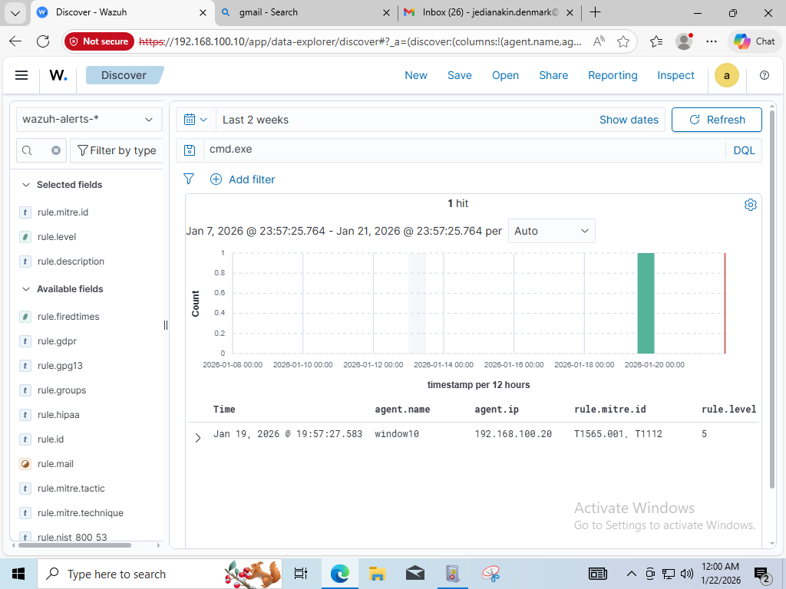

# 🚨 Incident Report  
## Stored Data Manipulation – Modify Registry

---

## 1. Incident Summary

| Item | Value |
|---|---|
| MITRE Technique | Stored Data Manipulation – Modify Registry |
| MITRE ID | T1565.001 |
| Rule ID | Y1112 |
| Severity Level | 5 |
| Detection Time | Jan 19, 2026 @ 19:57:27.583 |
| Detected By | Wazuh SIEM |

**Description:**  
A security alert was generated after detecting a Windows Registry modification that may indicate malicious activity such as persistence, defense evasion, or system configuration tampering.

---

## 2. Detection Rule Information

```yaml
rule.id: Y1112
rule.level: 5
rule.mitre.technique: Stored Data Manipulation – Modify Registry
rule.mitre.id: T1565.001
```
## 3. Affected Asset Information

- **Hostname:** window10
  - Wazuh field: `agent.name`

- **Agent ID:** 001  
  - Wazuh field: `agent.id`

- **Operating System:** window10  
  - Wazuh field: `agent.os.name`

- **IP Address:** 192.168.100.20  
  - Wazuh field: `agent.ip`

---

## 4. Registry Modification Details

- **Registry Key Path:** HKEY_LOCAL_MACHINE\System\CurrentControlSet\Services\bam\State\UserSettings\S-1-5-21-4023297114-3169236643-3074174325-1000  
  - Wazuh field: `syscheck.path`

- **Registry Action:** modified  
  - Wazuh field: `syscheck.event`

- **Registry Value (if available):** \Device\HarddiskVolume1\Windows\System32\cmd.exe  
  - Wazuh field: `syscheck.value_name`

- **Windows Event Channel:** - 
  - Wazuh field: `win.system.channel`


> Common Event IDs related to registry modification:
> - `4657` – Registry value modification  
> - `4663` – Registry object access  

---

## 5. Process & Execution Context

> Note: This alert was generated from registry monitoring (FIM).  
> Process execution details were not available in the current telemetry.

- **Process Information:** Not available  
- **Reason:** Registry modification detected via Wazuh FIM (syscheck), which does not include process execution context by default.

- **Relevant Decoder:** syscheck_registry_value_modified  
  - Wazuh field: `decoder.name`

- **Raw Log Reference:**  
  - Wazuh field: `full_log`
  Registry Value '[x32] HKEY_LOCAL_MACHINE\System\CurrentControlSet\Services\bam\State\UserSettings\S-1-5-21-4023297114-3169236643-3074174325-1000\\Device\HarddiskVolume1\Windows\System32\cmd.exe' modified Mode: scheduled Changed attributes: md5,sha1,sha256 Old md5sum was: '644d750a60fafb3a922117564dfa6681' New md5sum is : '625fd45330c2099c46fd3969b0734936' Old sha1sum was: '182c295d8d00858d7fb3e160911cf51ef253002c' New sha1sum is : 'e27aab06ee6883e7fbc2e45f9e7a4e0f04ea8a07' Old sha256sum was: '9a5d0fc88c6650c9746ce38a54417d6a86bc9e5d251d6d076fd5fb4a5cf7c22c' New sha256sum is : '594e0442c550883807705e6099e923bbb376c83d55c2a2c09380080a90471075'


---

## 6. Analysis

**Observed Behavior:**  
ตรวจพบการเปลี่ยนแปลงค่า Hash (MD5, SHA1, SHA256) ใน Registry Key ของ **Background Activity Moderator (BAM)**  
ซึ่งเกี่ยวข้องกับไฟล์ `cmd.exe` โดยเป็นการตรวจพบผ่านโหมด **Scheduled Scan** ของ Wazuh FIM (Syscheck)  
ระบบระบุชัดเจนว่าค่า Hash เดิม (Old md5sum) และค่า Hash ใหม่ (New md5sum) ไม่ตรงกัน

**Why This Is Suspicious:**

- **BAM Monitoring:**  
  โดยปกติ Windows จะใช้ BAM Key เพื่อบันทึกประวัติการรันโปรแกรม  
  การที่ Hash ของ `cmd.exe` เปลี่ยนแปลงอาจบ่งชี้ถึง  
  - การพยายามนำไฟล์อื่นมาปลอมชื่อเป็น `cmd.exe`  
  - หรือไฟล์ระบบถูกแก้ไข (File Integrity Breach)

- **Artifact Tampering:**  
  ผู้โจมตีมักแก้ไข Registry ส่วนนี้เพื่ออำพรางประวัติการรันคำสั่ง  
  (Anti-Forensics Technique)

- **MITRE ATT&CK T1565.001:**  
  พฤติกรรมนี้สอดคล้องกับการพยายามบิดเบือนข้อมูลที่ระบบจัดเก็บไว้  
  เพื่อหลบเลี่ยงการตรวจจับ

**Analyst Confidence Level:**

- [ ] Low  
- [x] Medium — มีความผิดปกติที่ยืนยันได้จากค่า Hash แต่ยังต้องยืนยันตัวตนของผู้ออกคำสั่งเพิ่มเติม  
- [ ] High  

---

## 7. Response Actions

- [x] **Alert triage performed**  
  - ดำเนินการคัดกรองและตรวจสอบความถูกต้องของ Alert เรียบร้อยแล้ว

- [x] **Registry change validated**  
  - ยืนยันการเปลี่ยนแปลงข้อมูลจากผลต่างของ Hash ใน Log เรียบร้อยแล้ว

- [x] **Investigation initiated**  
  - อยู่ระหว่างตรวจสอบความถูกต้องของไฟล์ `cmd.exe` บน Disk (File Check)

- [ ] **Endpoint isolated**  
  - จะดำเนินการหากพบว่า Hash ของไฟล์ `cmd.exe` ไม่ตรงกับไฟล์ที่ออกโดย Microsoft

- [ ] **Malicious process terminated**  
  - รอยืนยัน Process ID ที่เกี่ยวข้องจาก Log หรือ Telemetry อื่น

- [ ] **Registry value restored**  
  - พิจารณากู้คืนหากยืนยันได้ว่าข้อมูลถูกแก้ไขโดยเจตนาร้าย
  

---

## 8. Recommendations

- Enable registry integrity monitoring
- Limit registry modification privileges
- Correlate registry events with process creation logs
- Review and tune detection rules for high-risk registry paths

---

## 9. Evidence

### 9.1 Wazuh Alert Overview

**Purpose:**  
ใช้เป็นหลักฐานยืนยันการตรวจพบเหตุการณ์ (Detection Confirmation)  
ซึ่งแสดงรายละเอียดของ Rule, Severity และ MITRE ATT&CK Mapping  
จากระบบ Wazuh SIEM



**Information confirmed from this evidence:**
- Rule ID: `Y1112`
- Severity Level: `5`
- MITRE Technique: `T1565.001`
- Detection timestamp
- Affected host / agent
- Source of detection: Wazuh FIM (Syscheck)

---

**Evidence Limitation Notice:**  
หลักฐานในรายงานฉบับนี้อ้างอิงจาก Wazuh Alert Overview เป็นหลัก  
เนื่องจากไม่มี Registry raw log หรือ Process execution telemetry เพิ่มเติม  
ในช่วงเวลาที่ตรวจพบเหตุการณ์

การขาดข้อมูลดังกล่าวถูกบันทึกเป็นข้อจำกัดของ Telemetry  
และจะถูกนำไปพิจารณาในการปรับปรุงการเก็บ Log ในอนาคต

